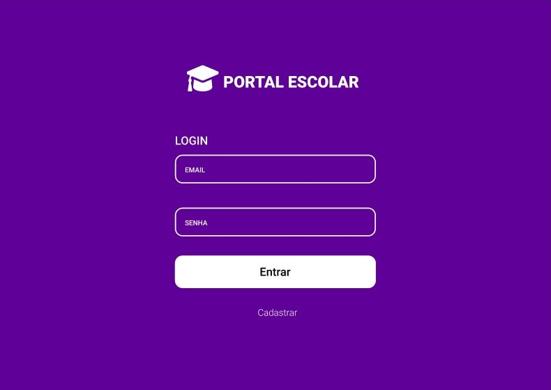

# DESAFIO

###### Comunidade I-DEV

[Veja o projeto no figma](https://www.figma.com/proto/oFqXE6zW97xGmvYtDB37I2/portal-escolar?node-id=4%3A156&scaling=scale-down "Veja o projeto no figma")

**OBJETIVO FINAL:**

> Criar um portal escolar para os professores gerenciar nota de avaliações aplicadas aos seus alunos.

#### O PORTAL DEVE PERMITIR

- ☐ CRIAR, EDITAR, EXCLUIR, ATUALIZAR, BUSCAR **ALUNOS**
- ☐ CRIAR, EDITAR, EXCLUIR, ATUALIZAR, BUSCAR **PROFESSORES**
- ☐ CRIAR, EDITAR, EXCLUIR, ATUALIZAR, BUSCAR **AVALIAÇÕES**
- ☐ CRIAR, EDITAR, EXCLUIR, ATUALIZAR, BUSCAR NOTA DE CADA ALUNO PARA UMA **AVALIAÇÃO**
- ☐ CRIAR, EDITAR, EXCLUIR, ATUALIZAR, BUSCAR **MATÉRIA DE ENSINO**
- ☐ EXIBIR INDICADIRES EM DASHBOARD QUE PERMITA OS PROFESSORES A:
- VERIFICAR A NOTA DE CADA ALUNO POR MATÉRIA
- VERIFICAR SE O ALUNO FOI APROVADO
- VERIFICAR A NOTA DO ALUNO PARA CADA AVALIAÇÃO APLICADA
- O ALUNO DEVE TER ACESSO AO PORTAL COM RESTRIÇÕES
- O ALUNO PODE VISUALIZAR O DASHBOARD LIMITADO APENAS AOS* SEUS DADOS
- O DASHBOARD O ALUNO DEVE VISUALIZAR QUEM SÃO SEUS PROFESSORES

